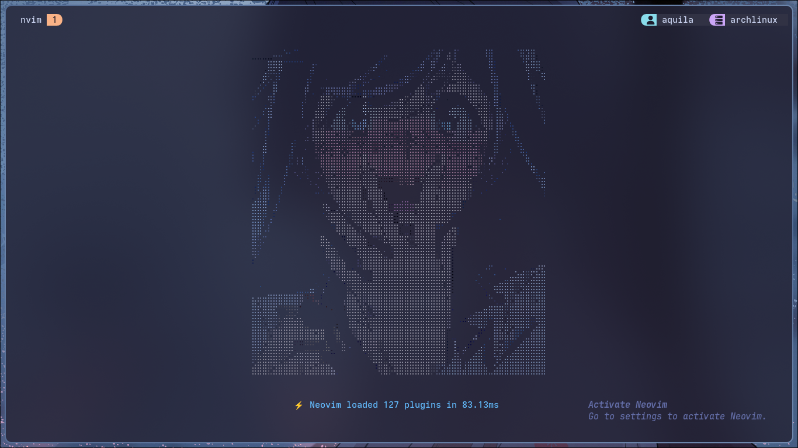
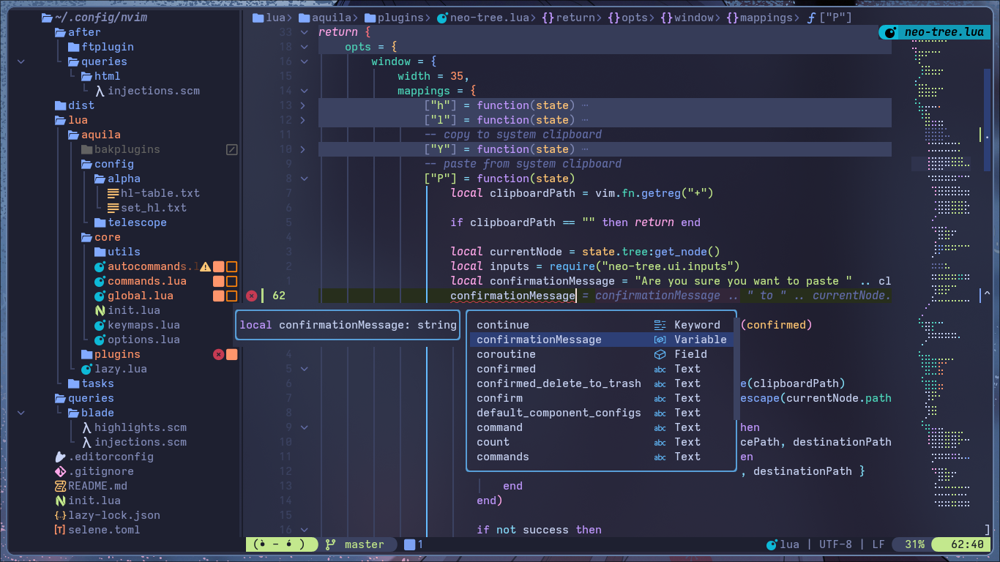
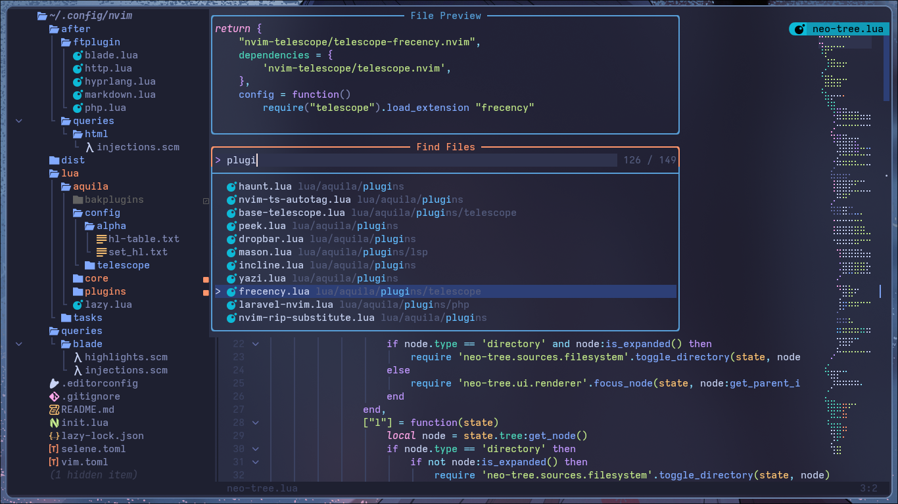

# Aquila's Neovim Configuration

My Neovim configuration written from **scratch** (of course, with some ~stolen~ *take inspiration* from others). This is also part of the gitmodules in my dotfiles. See [Aquila's Dotfiles](https://github.com/rizkyilhampra/dotfiles) for the rest of the setup.

> [!WARNING]
> The documentation is still a work in progress.
 
## Screenshots



<!-- <details> -->
<!-- <summary>More Screenshots (Click to expand)</summary> -->
<!---->
<!--  -->
<!--  -->
<!-- </details> -->

## Acknowledgements
- [NormalNvim](https://github.com/NormalNvim/NormalNvim)

<!--
## Requirements

> Forgive me if i'm missed anything. Please run `:checkhealth` to see if you are not missed some dependencies after clone/install my config.

`git` `tar` `zip` `unzip` [`jq`](https://github.com/sharkdp/fd) [`tidy`](https://www.html-tidy.org/) [`curl`](https://curl.se/) [`fd`](https://github.com/sharkdp/fd) [`ripgrep`](https://github.com/BurntSushi/ripgrep) [`fzf`](https://github.com/junegunn/fzf) `gcc` `libstdc++` [`make`](https://www.gnu.org/software/make/) [`deno`](https://deno.com/) `webkitgtk2`

|                           |                                                                                                                                                                                                                                                                                                                                                             |
| ------------------------- | ----------------------------------------------------------------------------------------------------------------------------------------------------------------------------------------------------------------------------------------------------------------------------------------------------------------------------------------------------------- |
| GNU Linux                 | I've never tried other OS except Linux to run Neovim, so i can't promise it will work as you'are exepected if you try run in other OS (explicitly Windows without WSL). I'm using Arch btw                                                                                                                                                                  |
| Nerd Font                 | Search font in [here](https://nerdfonts.com) and chose by your preference then use in your terminal, or you can use only `Symbol Nerd Font` if your terminal support fallback font. Take look in [here](https://github.com/rizkyilhampra/dotfilesv2/blob/49461bba79a15749ddf29531aed3cde4ecb34533/.config/kitty/kitty.conf#L1-L4) to see what fonts i used. |
| Neovim v10/nightly build  | Install with [bob](https://github.com/MordechaiHadad/bob) as Neovim version manager or build from source in [here](https://github.com/neovim/neovim?tab=readme-ov-file#install-from-source)                                                                                                                                                                 |
| Terminal                  | Use terminal true color support. I use [kitty](https://sw.kovidgoyal.net/kitty/) and [alacritty](https://alacritty.org/). Take look in [here](https://github.com/rizkyilhampra/dotfilesv2/blob/main/.config/kitty) or [here](https://github.com/rizkyilhampra/dotfilesv2/tree/main/.config/alacritty) to see my terminal configuration                      |
| Clipboard Tools           | If you are not using DE. Maybe you need clipboard tool program. I use [`wl-copy`](https://github.com/bugaevc/wl-clipboard)                                                                                                                                                                                                                                  |
| Node (Javascript runtime) | Install with [`fnm`](https://github.com/Schniz/fnm) as node version manager or if you need to install only one version, take look in [here](https://github.com/nodesource/distributions?tab=readme-ov-file#installation-instructions)                                                                                                                       |
| Python                    | I'm not sure is needed, if you want to install ensure `python3` is installed too                                                                                                                                                                                                                                                                            |

#### Optional

[`lazydocker`](https://github.com/jesseduffield/lazydocker) [`lazysql`](https://github.com/jorgerojas26/lazysql) [`lazygit`](https://github.com/jesseduffield/lazygit)

## Installation

> [!NOTE]
> You can copy all below commands and paste them in your terminal, then press `enter` and wait until finish.

### As default neovim configuration

> [!WARNING]
> Please ensure there is no neovim configuration before, or these commands will fail.

```bash
mkdir -p ~/.config/nvim && \
cd ~/.config/nvim && \
git clone https://github.com/rizkyilhampra/nvim-config.git . && \
nvim
```

### As alias NVIM_APPNAME

```bash
git clone https://github.com/rizkyilhampra/nvim-config.git ~/.config/ripnvim && \
NVIM_APPNAME=ripnvim nvim
```

#### Optional

Make shell alias in your shell configuration, ex in zsh:

```bash
# ~/.zshrc
alias ripnvim="NVIM_APPNAME=ripnvim nvim"
```

## Todo

- [ ] Make readme more nicer for new comer
- [ ] Refactor LSP configuration
- [x] Fix blank startup screen when open neovim with argument, example: `nvim README.md`
- [ ] Test to replace Gitsign to Mini.diff as statuscol view
-->
