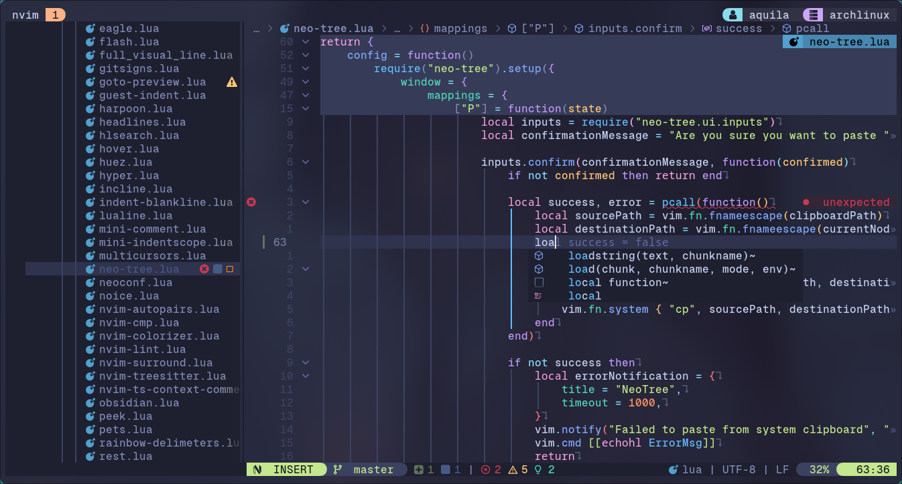

# Aquila's Neovim Configuration
My personal neovim configuration written from scratch (of course, with stolen other neovim configuration from somewhere). I use this with my workflow and/or environment, see [Aquila's Dotfiles](https://github.com/rizkyilhampra/dotfilesv2). Currently is configured well with PHP/Laravel development (yes, i mainly use 'php is dead' language). Let see if i'm moved focus to another language/framework, i will update my writing here (if i'm not lazy too).




## Requirements
> Forgive me if i'm missed anything. Please run `:checkhealth` to see if you are not missed some dependencies after clone/install my config.

The Things|Description
---|---
Linux|I've never tried other OS except Linux to run Neovim, so i can't promise it will work as you'are exepected if you try run in other OS. I'm currently using Arch btw
Git|-
Nerd Font|Search font in [here](https://nerdfonts.com) and chose by your preference then use in your terminal (i'm using [GeistMono](https://github.com/ryanoasis/nerd-fonts/releases/download/v3.1.1/GeistMono.zip))
Neovim v10/nightly build|I would recomend using [bob](https://github.com/MordechaiHadad/bob) as Neovim version manager or build from source in [here](https://github.com/neovim/neovim?tab=readme-ov-file#install-from-source)
Terminal|There are so many terminal, chose your preference. I use [kitty](https://sw.kovidgoyal.net/kitty/) and/or [alacritty](https://alacritty.org/).
Clipboard (optional)|If you are not using DE. Maybe you need clipboard tool. I use [`wl-copy`](https://github.com/bugaevc/wl-clipboard)
C Compiler|`gcc` `libstdc++`
[`make`](https://www.gnu.org/software/make/)|-
[Rust](https://www.rust-lang.org/tools/install) environment|Ensure `cargo` is installed too
Node (Javascript runtime)|I use [`fnm`](https://github.com/Schniz/fnm) as node version manager. If you need install only one version, take look in [here](https://github.com/nodesource/distributions?tab=readme-ov-file#installation-instructions)
Python|I'm not sure is needed, if you want to install ensure `python3` is installed too
[`fzf`](https://github.com/junegunn/fzf)|As far i know it's required for telescope.nvim plugin
[`ripgrep`](https://github.com/BurntSushi/ripgrep)|-
[`fd`](https://github.com/sharkdp/fd)|-
[Deno (another javascript runtime)](https://deno.com/)|Required for peek.nvim plugin for showing markdown preview
[`jq`](https://github.com/sharkdp/fd) [`tidy`](https://www.html-tidy.org/) [`curl`](https://curl.se/)|Required for rest.nvim plugin (it's works like postman)
`tar` `zip` `unzip`|-

## Installation
> You can copy all below code and paste them in your terminal, then press `enter` and wait until finish.
```bash
mkdir -p ~/.config && \
cd ~/.config && \
git clone https://github.com/rizkyilhampra/nvim-config.git nvim && \
cd nvim && \
nvim
```