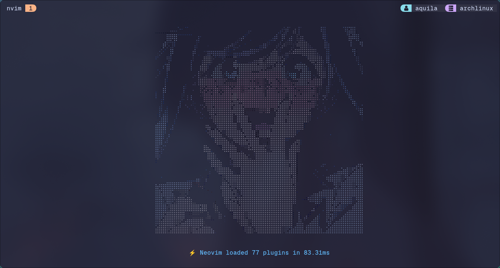
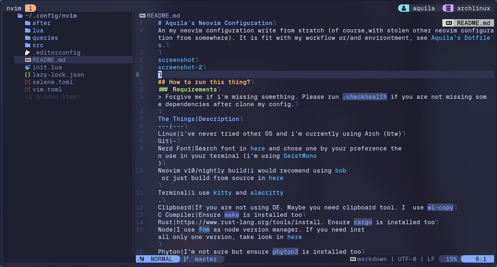

# Aquila's Neovim Configuration
My neovim configuration written from scrath (of course, with stolen other neovim configuration from somewhere). It fits with my workflow and/or environtment, see [Aquila's Dotfiles](https://github.com/rizkyilhampra/dotfilesv2).




## Requirements
> Forgive me if i'm missing something. Please run `:checkhealth` to see if you are not missing some dependencies after clone my config.

The Things|Description
---|---
Linux|I've never tried other OS except Linux to run Neovim, so i can't promise it will work as you'are exepected if you try run in other OS. Oh ya, i'm currently using Arch (btw)
Git|-
Nerd Font|Search font in [here](https://nerdfonts.com) and chose by your preference then use in your terminal (i'm using [GeistMono](https://github.com/ryanoasis/nerd-fonts/releases/download/v3.1.1/GeistMono.zip))
Neovim v10/nightly build|I would recomend using [bob](https://github.com/MordechaiHadad/bob) as Neovim version manager or if you want, just build from source in [here](https://github.com/neovim/neovim?tab=readme-ov-file#install-from-source)
Terminal|There are so many terminal, chose your preference. I use [kitty](https://sw.kovidgoyal.net/kitty/) and/or [alacritty](https://alacritty.org/).
Clipboard (optional)|If you are not using DE. Maybe you need clipboard tool. I use `wl-copy`
C Compiler|Ensure `make` is installed too
[Rust](https://www.rust-lang.org/tools/install)|Ensure `cargo` is installed too
Node|I use [`fnm`](https://github.com/Schniz/fnm) as node version manager. If you need install only one version, take look in [here](https://github.com/nodesource/distributions?tab=readme-ov-file#installation-instructions)
Phyton|I'm not sure is needed, but just ensure `phyton3` is installed too
[`fzf`](https://github.com/junegunn/fzf)|As i know it required by Telescope plug
[`ripgrep`](https://github.com/BurntSushi/ripgrep)|-
[`fd`](https://github.com/sharkdp/fd)|-
[Deno (another javascript runtime)](https://deno.com/)|Required by peek.nvim plugin for showing markdown preview
[`jq`](https://github.com/sharkdp/fd) [`tidy`](https://www.html-tidy.org/) [`curl`](https://curl.se/)|Required by rest.nvim plugin (the function is same as postman)

## Installation
> You can copy all below code and paste them in your terminal, then press `enter` and wait until finish.
```bash
mkdir -p ~/.config && \
cd ~/.config && \
git clone https://github.com/rizkyilhampra/nvim-config.git nvim && \
cd nvim && \
nvim
```